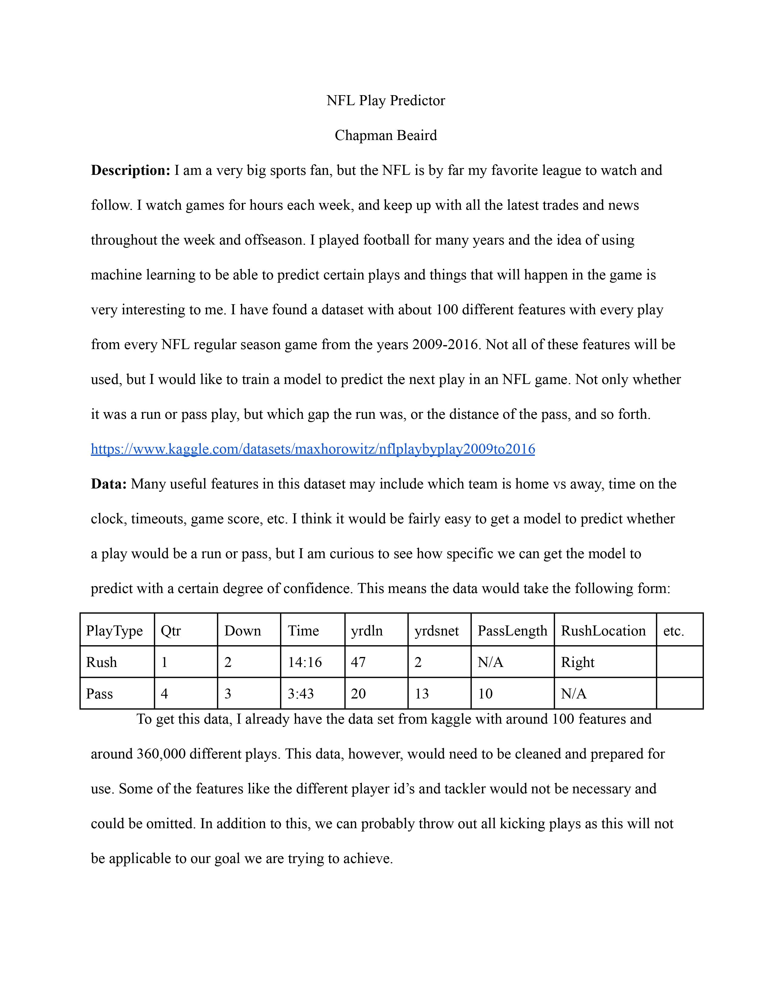

# NFL-Play-Predictor

## Introduction

This projects goal is to predict the next type of play, pass or run, in an NFL game. The data used is from 2009 to 2018 and includes every game from those seasons. We will need to clean the data, engineer features, and then use several different models to predict the next play. We will then compare the models and see which one is the best at predicting the next play.

## Proposal

